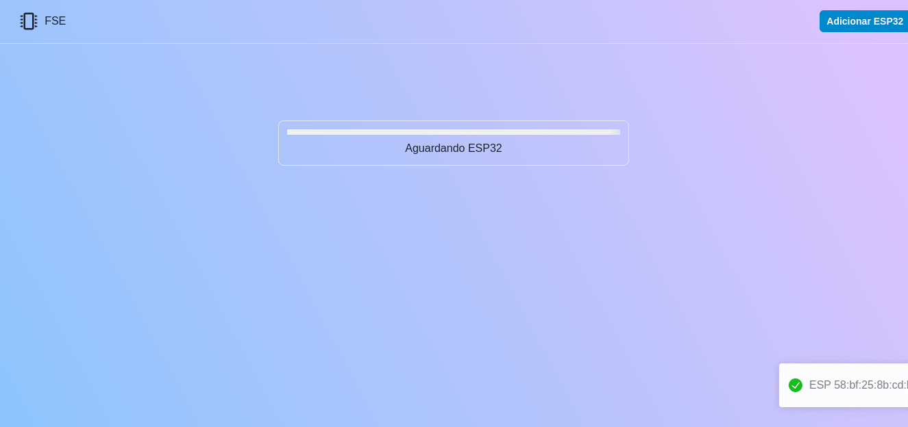
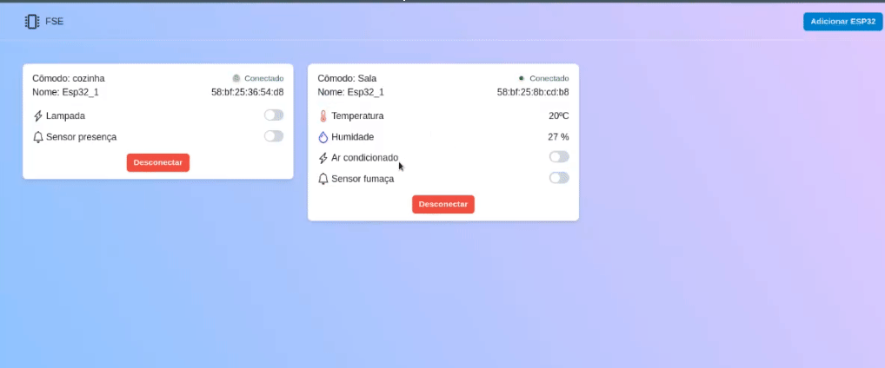
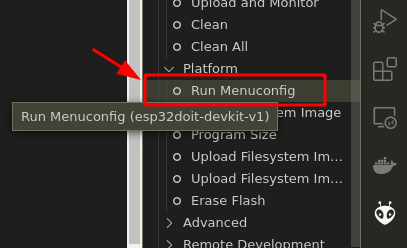
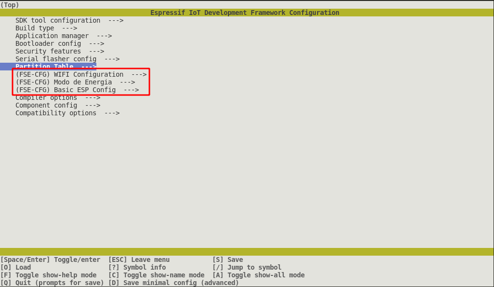
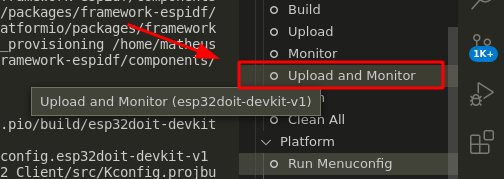

# Trabalho final - FSE

## Integrantes

| Matrícula  | Aluno                           |
|------------|---------------------------------|
| 18/0106970 | Matheus Gabriel Alves Rodrigues |
| 18/0129287 | Pedro Henrique Vieira de Lima   |

## Descrição

O objetivo deste trabalho é criar um sistema distribuído de Automação Residencial utilizando um computador como sistema computacional central e microcontroladores ESP32 como dispositivos distribuídos, interconectados via Wifi através do protocolo MQTT.





***Observações:***

O projeto utiliza o broker público: [broker.hivemq.com](https://www.hivemq.com/public-mqtt-broker/)

- TCP Port: ```1883```
- Websocket Port: ```8000```

## Apresentação do projeto

A dupla gravou uma apresentação do projeto e disponibilizou no seguinte [link](https://www.youtube.com/watch?v=9WtdAng3mqA&ab_channel=PedroHenrique).

## Executando o projeto

Comandos para executar as partes do projeto:

### Central

* Acessar o repositório do front-end:

```bash
$ cd central
```

* Executar o front da aplicação utilizando o docker-compose:

```bash
$ docker-compose up -d --build
```

* Acessar a url [localhost:3000](localhost:3000)

### Distribuido

Para o desenvolvimento do client que será usado nas **esp32's** foi utilizado a **IDE PlatformIO** de maneira que para executar o projeto recomenda-se a sua utilização.


* Abrir o projeto na IDE

* Configurar o ambiente utilizando o `Menuconfig`





* Executar o projeto utilizando a opção `upload and monitor`


